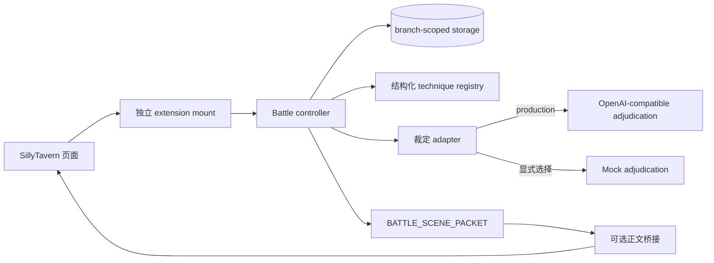

# `st-xybattle-sys` 架构契约

本文描述独立 `battle_v2` 扩展的边界和数据契约。它是实现和测试的约束，不把某一版 `src/` 函数签名当作公共 API。实现可以替换模块，只要继续满足这里的可见性、持久化和幂等要求。

## 目标与边界

扩展挂载在 SillyTavern 页面上，但战斗状态、裁定和正文桥接都由自己的控制器和存储负责。扩展通过一个明确的挂载点注册 UI；它不改写主剧情提示词、主剧情历史或其他插件的 DOM。主剧情系统只通过可选的 `BATTLE_SCENE_PACKET` 桥接接收已经提交的事实。



扩展内部至少有五个逻辑边界：

1. **Mount/UI**：创建和销毁独立根节点，转发用户行动，不持有隐藏信息。
2. **Controller/state machine**：按回合和 `actionId` 驱动状态转移；只有提交后的裁定才能影响下一回合。
3. **Registry**：保存可校验的功法和招式条目，提供版本、可见性和 `ruleRefs`。
4. **Adapters**：把结构化裁定请求交给模型或离线 mock，并校验返回结构。
5. **Storage/logging**：按分支保存会话和日志；日志可以审计流程，但不能把 hidden 信息发布到玩家层。

## 两阶段模型调用

每次行动分为两个阶段，不能合并成一次“生成正文并顺便判定”的调用：

### 1. 独立裁定

裁定器接收当前回合的结构化上下文、玩家行动、registry 快照和已提交事实。它只返回结构化结果，例如：

```json
{
  "summary": "可读的本轮结果",
  "before": {"...": "提交前语义状态"},
  "after": {"...": "本轮允许改变的语义状态"},
  "reason": "使用的因果解释",
  "ruleRefs": ["registry.technique.example"],
  "publicEvents": ["玩家可观察的事件"],
  "confidence": 0.8
}
```

程序负责验证 `before` 与当前状态一致、字段在本轮允许的范围内、`ruleRefs` 非空以及可见性边界。模型不能直接写入完整会话，也不能凭空增加未提交的数值结算。

**生产默认**是 OpenAI-compatible 的结构化裁定 endpoint。配置至少需要 endpoint、model 和可选的授权头；凭据只存在于运行时设置，不进入持久化设置、导出文件或日志。未配置生产 endpoint 时可以使用显式的“未配置”保护适配器来阻止提交，但不能静默切换到 mock。请求失败或响应不合格时，状态应停留在可重试的玩家决策阶段，并保留错误信息。

**Mock 只能显式选择**，用途是离线开发、契约测试和 UI 演示。选择 mock 时应在设置或运行信息中可见“Mock/离线”，不能把 mock 结果描述为真实模型结果，也不能把 mock 当作生产默认。

### 2. 正文桥接

裁定提交后生成 `BATTLE_SCENE_PACKET`。场景包携带本轮 `committedFacts`、地点和时间、公开事件、角色可感知的信息、原始玩家行动和下一决策点，并带有以下硬性约束：

- 保留用户原始 prompt 的语义意图；
- 只能描写已经提交的因果和可见变化；
- 禁止重新裁定本轮行动；
- 禁止新增未提交的数值或隐藏信息。

真实 SillyTavern 主生成桥在完成端到端验证前，文档、UI 和发布说明都只能称为“接口/场景包已准备”或“可选桥接”。不能声称真实主生成已接通。内置正文 mock 同样必须标记为演示。

## 结构化 registry

功法 registry 是数据，而不是散落在 prompt 或 UI 事件里的字符串。每条记录应至少包含：

- 稳定 `id`、显示名、版本、阶位/属性和核心原则；
- 机制列表、协同关系、叙事指导；
- `techniques[]`，每个招式含原始定义、机制、默认可用状态、触发后状态；
- `visibility` 和非空 `ruleRefs`。

registry 在创建会话时形成快照并写入会话。后续修改 registry 不得静默改变已开始分支的历史裁定；新分支可以使用新版本。`schema/battle-technique.schema.json` 是数据层校验的参考，运行时仍须做可见性和业务规则校验。

## 分支作用域存储

存储键或记录主键必须包含明确的分支/会话标识，例如 `battle_v2:<branchId>:session`、`...:logs`。同一用户可以同时打开多个分支，读取、写入、导出和恢复都不能交叉覆盖。若实现只支持单一活动分支，也必须显式保存 `activeBranchId`，并拒绝把其他分支的数据当作当前会话。

建议的持久化对象：

```text
branch metadata  -> branchId, createdAt, registryVersion
session          -> battle_v2 state machine and registry snapshot
logs             -> append-only audit records scoped to branchId
settings         -> endpoint/model/tuning; apiKey is runtime-only
```

写入应采用完整对象替换或等价的原子操作；恢复前验证 schema、phase、branchId 和版本。导出可以包含当前分支的审计日志，但不能包含运行时凭据。

## 可见性与日志

状态至少有两种视图：

- **AI read context**：裁定器为完成规则判断所需的上下文，可含敌方 hidden 字段；只发送到受信任的裁定 adapter，不直接渲染。
- **player/public view**：UI、正文桥接和公开日志可见的内容，必须经过投影；敌方 `hidden`、内部提示、凭据和 adapter 原始请求不得出现。

日志可以同时保留 request metadata、公开投影和内部审计字段，但“可展开”不等于“公开”。面向玩家的日志导出应只导出 public view；管理员调试日志若包含 AI read context，必须有明确的内部用途和访问边界。任何日志、异常、导出和 DOM 文本都应通过统一的脱敏函数处理 endpoint authorization、API key、cookie 和 hidden 字段。

## 幂等与状态转移

客户端重试同一个 `actionId` 时，控制器返回已有记录，不得再次调用裁定器或正文生成器。建议状态序列：

```text
idle -> awaiting_player -> judging -> committed -> narrating -> awaiting_next
                         \-> awaiting_player (可重试错误)
awaiting_next -> ended / awaiting_player (下一回合)
committed     -> rewrite -> awaiting_next (只重写正文，不重新裁定)
```

状态记录的 `version`、`roundId` 和 `actionId` 用于并发检测。重写只能使用已提交的场景包，不能修改 `before/after` 或重新调用裁定器。

## 测试与验收计划

测试实现应在接口重写完成后落地，优先覆盖契约而非 UI 像素：

1. **Registry**：必填字段、重复 id、深拷贝隔离、版本快照和 `ruleRefs`。
2. **State machine**：合法/非法 phase 转移、恢复校验、`actionId` 幂等和重写不重裁定。
3. **Visibility**：player view、场景包、公开日志均不含 hidden、内部 prompt 或授权信息。
4. **Storage**：两个 branch 的读写互不污染；导出不含 API key；损坏 JSON 安全回退或报错。
5. **Adapters**：生产默认选择 OpenAI-compatible adapter；mock 只有显式模式可用；HTTP 错误和无效 JSON 不推进提交。
6. **Integration**：裁定结果先提交，再构建场景包；真实 ST 主生成桥接需单独的实机测试标记，未验证时测试报告不得写“已接通”。

运行入口以 `package.json` 为准。最低门槛是 `npm test` 和 `npm run lint`；任何依赖真实网络或 SillyTavern 主生成的测试必须单独命名、默认跳过，并在报告中注明未验证原因。

## 已知验证边界

本仓库可以验证独立战斗控制器、数据 registry、存储隔离、适配器契约和场景包结构。真实 SillyTavern 主生成桥需要在目标实例中完成登录态、扩展加载、实际生成和回写检查；在这些证据出现前，发布状态只能是“独立战斗系统可用，主生成桥待实机验证”。
