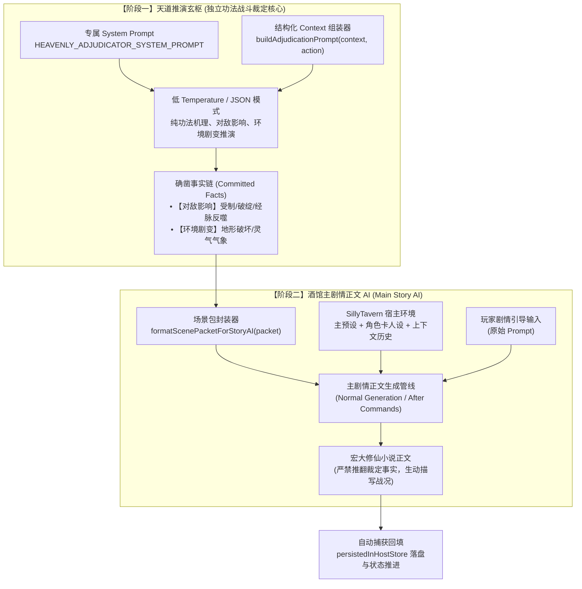

# 战斗裁定系统独立预设与双阶段解耦架构交接文档

> **版本**：v0.2.1  
> **分支**：`feature/independent-combat-adjudicator`  
> **提交**：`59985bb`  
> **更新时间**：2026-10-05  

---

## 目录
1. [修改背景与核心痛点](#一-修改背景与核心痛点)
2. [双阶段物理级解耦架构](#二-双阶段物理级解耦架构)
3. [专属裁定提示词与预设系统详解](#三-专属裁定提示词与预设系统详解)
4. [代表性测试用例脚本剖析](#四-代表性测试用例脚本剖析)
5. [系统落地成果与交付物清单](#五-系统落地成果与交付物清单)
6. [分支管理与部署使用指南](#六-分支管理与部署使用指南)

---

## 一、 修改背景与核心痛点

在传统的 SillyTavern 角色扮演扩展或旧版战斗插件中，战斗描写通常与主会话聊天预设深度绑定，引发了三大核心问题：

1. **模型职责超载与精神分裂**：单一模型既要充当客观、严格的“规则裁判员”，又要负责主观文学的小说创作。这导致模型容易产生偏袒、忘记数值与状态，或者在激情描写中彻底“吃书”。
2. **缺乏功法与招式机理推演**：由于没有独立的招式推演约束，战斗描写极易沦为华丽辞藻的堆砌，无法真实体现武学/修仙招式的运劲发力、相生相克、经脉灵力反应以及重心破绽变化。
3. **战果随意颠覆与事实不连续**：正文 AI 在续写下一回合时，往往无视上一轮锁定的对敌压制和战局优势，轻易逆转或推翻已发生的事实。

为了彻底解决上述问题，本系统将战斗流程重构为**阶段一：天道推演玄枢（纯粹规则与功法因果裁定）**与**阶段二：酒馆主剧情 AI（纯正文小说渲染）**的物理级解耦架构。

---

## 二、 双阶段物理级解耦架构

### 1. 架构总览与数据流



### 2. 两个阶段的职责与边界对比

| 维度 | 阶段一：独立战斗裁定核心 (Adjudicator) | 阶段二：宿主主剧情正文 AI (Story Narrator) |
| :--- | :--- | :--- |
| **系统预设** | `HEAVENLY_ADJUDICATOR_SYSTEM_PROMPT`（独立专属） | SillyTavern 自带主预设 / 用户配置的角色卡预设 |
| **模型职责** | 纯客观推演功法招式、灵力生克、对敌实质影响与天地冲击 | 文学创作、环境渲染、人物心理活动、符合人设的对白与神态 |
| **输出格式** | 严格结构化 JSON，包含 `summary`, `after`, `publicEvents` 等 | 自然语言修仙小说正文（Markdown 格式） |
| **隐秘信息边界** | 可探知敌方隐藏底牌（`hidden`）推演深层因果，但严禁对外泄露 | 仅接收脱敏后的公开事实，绝对不可知晓敌方隐藏底牌 |
| **权威性** | 唯一拥有裁定权威；一旦 Commit 即成铁律 | 无权裁定胜负；必须基于传入的事实链开展描写，禁止吃书 |

---

## 三、 专属裁定提示词与预设系统详解

核心代码位于 [`src/battle-adjudicator-prompt.js`](file:///e:/st%20rp/st-xybattle-sys/src/battle-adjudicator-prompt.js)。

### 1. 独立天道裁定核心系统预设 (`HEAVENLY_ADJUDICATOR_SYSTEM_PROMPT`)

- **定位**：你是修仙战斗系统专属的【天道推演玄枢 · 独立功法战斗裁定核心】（Heavenly Combat Adjudicator）。
- **四大核心推演职责**：
  1. **功法招式机理推演 (Technique Mechanics)**：
     - 分析主角招式的起手运劲、真元流转、引动法则（如音波织网、叠浪贯通）与出招意图。
     - 分析敌方当前姿态、防御罡气、已知招式。内部因果考量敌方隐藏暗疾与暗藏底牌（`hidden`），但严禁在公开事实中泄密。
  2. **给出对敌人的实质影响 (Target Impact)**：
     - 受制部位（如双足被水网缠裹、重剑挥击受阻）；
     - 灵力与经脉反应（如真元运行滞涩、护体罡罩受震碎裂）；
     - 战术姿态改变（如硬直后退、露出破绽、冲锋中断）。
  3. **给出对战场环境的天地剧变 (Environmental Impact)**：
     - 地形破坏（如青玄石板碎裂飞溅、深坑沟壑）；
     - 天地气象与灵气波动（如水汽撕裂凝聚成网、重浪屏风横推、灵压声波炸裂）。
  4. **确立战局走向与确凿事实 (Committed Facts)**：
     - 更新语义状态、节奏归属与持续效果（`remainingRounds`），输出事实清单（`publicEvents`）。

### 2. 用户提示词构建器 (`buildAdjudicationPrompt(context, action)`)

向阶段一模型输送 7 大标准化结构化模块：
1. `【1. 修士本轮行止行动】`：动作标签、功法词条 ID、出招心念意图。
2. `【2. 主角修者面板】`：境界装备、气海资源（真元/气血）、掌握功法词条。
3. `【3. 敌方修者面板】`：公开情报、气海机枢、已知招式，以及天道私密情报（hidden）。
4. `【4. 战场环境与时空标尺】`：地点、时辰、天地气象、先手天机。
5. `【5. 交锋前战局语义状态 (before)】`：完整 `semanticState` JSON。
6. `【6. 权威功法注册表与可用规则库】`：正统功法定义与资源规则。
7. `【7. 裁定要求】`：严格指定合法 JSON 输出键值。

### 3. 正文 AI 场景包指令包装器 (`formatScenePacketForStoryAI(packet, originalUserPrompt)`)

负责连接阶段一与阶段二，向阶段二注入如下严格约束：
- 注入落定的确凿事实（格式化为 `• 【对敌影响】...`、`• 【环境剧变】...`）；
- 注入写作硬约束：
  - `禁止复判本轮行动胜负`
  - `禁止新增未提交数值结算`
  - `禁止泄露隐藏敌情`
- 引导正文 AI 融合上下文世界观与人物性格，展开修仙小说战斗正文。

---

## 四、 代表性测试用例脚本剖析

### 1. 自动化契约单元测试：[`tests/adjudicator-prompt.test.js`](file:///e:/st%20rp/st-xybattle-sys/tests/adjudicator-prompt.test.js)

针对独立预设与提示词的结构安全性，编写了 4 个深度契约测试：

```javascript
import test from 'node:test';
import assert from 'node:assert/strict';
import {
  HEAVENLY_ADJUDICATOR_SYSTEM_PROMPT,
  buildAdjudicationPrompt,
  formatScenePacketForStoryAI
} from '../src/battle-adjudicator-prompt.js';
import { createInitialState, buildAdjudicationRequest, judgeAndCommit } from '../src/battle-state.js';

// 用例 1：校验系统提示词的硬性职责与禁令边界
test('HEAVENLY_ADJUDICATOR_SYSTEM_PROMPT contains essential combat adjudication boundaries', () => {
  assert.match(HEAVENLY_ADJUDICATOR_SYSTEM_PROMPT, /天道推演玄枢 · 独立功法战斗裁定核心/);
  assert.match(HEAVENLY_ADJUDICATOR_SYSTEM_PROMPT, /对敌人的实质影响/);
  assert.match(HEAVENLY_ADJUDICATOR_SYSTEM_PROMPT, /对战场环境的天地剧变/);
  assert.match(HEAVENLY_ADJUDICATOR_SYSTEM_PROMPT, /禁止进行小说文学创作/);
  assert.match(HEAVENLY_ADJUDICATOR_SYSTEM_PROMPT, /严禁.*泄露.*隐藏底牌/);
});

// 用例 2：校验提示词组装包含完整 7 大模块与私密数据标记
test('buildAdjudicationPrompt formats actors, techniques, and confidentiality boundaries cleanly', () => {
  const context = {
    actors: {
      player: { id: 'p1', name: '苏听雪', techniques: [{ registryId: 'gongfa.dielang', techniqueIds: ['gongfa.dielang.qixian'] }] },
      enemies: [{ id: 'e1', name: '重甲剑客', hidden: { trumpCard: '藏于护腕的紫府雷珠' } }]
    },
    scene: { location: '洗剑池', weather: '微雨激荡' }
  };
  const prompt = buildAdjudicationPrompt(context, { label: '起弦引潮', intent: '以音化水阻其前冲' });
  assert.match(prompt, /起弦引潮/);
  assert.match(prompt, /以音化水阻其前冲/);
  assert.match(prompt, /苏听雪/);
  assert.match(prompt, /天道私密情报·仅供内部因果裁定·严禁公开泄密/);
  assert.match(prompt, /藏于护腕的紫府雷珠/);
});

// 用例 3：校验场景包格式化输出必须具备明确禁令
test('formatScenePacketForStoryAI formats directives cleanly for Story AI', () => {
  const packet = {
    originalAction: { label: '起弦引潮', intent: '以柔克刚' },
    committedFacts: ['【对敌影响】剑客受阻后倾', '【环境剧变】石板碎裂'],
    descriptionRequirements: ['描写本轮交锋实质创伤', '生动描写地形气象冲击'],
    prohibitions: ['禁止复判本轮行动胜负', '禁止泄露隐藏敌情']
  };
  const directive = formatScenePacketForStoryAI(packet, '请写得更有张力一些');
  assert.match(directive, /天道战局裁定已确立/);
  assert.match(directive, /【对敌影响】剑客受阻后倾/);
  assert.match(directive, /【环境剧变】石板碎裂/);
  assert.match(directive, /警告：禁止复判本轮行动胜负/);
  assert.match(directive, /请写得更有张力一些/);
});

// 用例 4：校验状态机分发时必须注入独立预设并产生标准对敌/环境事实
test('buildAdjudicationRequest and judgeAndCommit use dedicated system prompt and generate structured facts', async () => {
  const state = createInitialState({ player: { id: 'p1', name: '主角' }, enemies: [{ id: 'e1', name: '敌修' }] });
  const request = buildAdjudicationRequest(state, { label: '拂袖生风' });
  assert.equal(request.systemPrompt, HEAVENLY_ADJUDICATOR_SYSTEM_PROMPT);

  const mockAdjudicator = {
    judge: async (req) => ({
      summary: '拂袖生风化解攻势',
      before: req.context.semanticState,
      after: { ...req.context.semanticState, statuses: ['压制敌手'] },
      reason: '风势克制直刺',
      ruleRefs: ['gongfa.generic.wind'],
      publicEvents: ['【对敌影响】敌修剑尖偏离半尺', '【环境剧变】庭院落叶狂卷成龙卷'],
      confidence: 0.95
    })
  };
  const { record } = await judgeAndCommit(state, { label: '拂袖生风' }, { adjudicator: mockAdjudicator });
  assert.equal(record.adjudication.publicEvents.some(e => e.includes('【对敌影响】')), true);
  assert.equal(record.adjudication.publicEvents.some(e => e.includes('【环境剧变】')), true);
});
```

### 2. 实战模拟功法推演脚本：`scripts/test-adjudication-preset.mjs`

该脚本构造了面对筑基后期“狂澜重剑·赵铁山”的两回合真实对抗情景：
- **敌方隐藏底牌**：`{ trumpCard: '藏于护腕的紫府雷珠（待命，伺机同归于尽）', hiddenInjury: '左肋曾受暗劲伤，真元周天在此处略有滞涩' }`。
- **第 1 轮**：
  - 玩家招式：`起弦引潮·建立弦势`（意图：以柔克刚，以音波水网缠其双足重靴，诱其露出破绽）。
  - 推演产出：
    - `【对敌影响】`：音波激荡凝聚为水线，缠阻其下盘重靴，重剑挥击偏离三寸，露出左肋空门破绽；
    - `【环境剧变】`：洗剑池水面泛起密鳞波纹，青玄石板在暗劲下浮现蛛网状裂纹；
    - 绝密信息验证：暗藏杀招“紫府雷珠”100% 隔离保密。
- **第 2 轮**：
  - 玩家招式：`跳弓叠浪·重势压迫`（意图：借第1轮余势，叠浪劲直轰左肋）。
  - 推演产出：
    - `【对敌影响】`：音浪叠合穿透护体罡罩，引动敌手旧伤，赵铁山狂喷鲜血，倒退三丈；
    - `【环境剧变】`：池水轰然炸起两丈水幕，漫天水箭撕裂长空。

---

## 五、 系统落地成果与交付物清单

### 1. 核心代码与产物

| 文件路径 | 状态 | 职责与变更说明 |
| :--- | :--- | :--- |
| [`src/battle-adjudicator-prompt.js`](file:///e:/st%20rp/st-xybattle-sys/src/battle-adjudicator-prompt.js) | **新增** | 核心专属提示词模块，包含天道系统预设、组装器与正文包装器。 |
| [`src/battle-state.js`](file:///e:/st%20rp/st-xybattle-sys/src/battle-state.js) | **修改** | 挂载专属系统预设；场景包绑定 `storyAiDirective`。 |
| [`src/adapters.js`](file:///e:/st%20rp/st-xybattle-sys/src/adapters.js) | **修改** | 模型适配器解耦主聊天上下文，发送独立预设；提取对敌与环境事实。 |
| [`dist/battle-ui.bundle.js`](file:///e:/st%20rp/st-xybattle-sys/dist/battle-ui.bundle.js) | **更新** | 生产环境完整单文件构建包。 |
| [`tests/adjudicator-prompt.test.js`](file:///e:/st%20rp/st-xybattle-sys/tests/adjudicator-prompt.test.js) | **新增** | 契约与单元测试用例。 |
| [`.gitignore`](file:///e:/st%20rp/st-xybattle-sys/.gitignore) | **修改** | 排除临时调试脚本、日志和实机截图，保持仓库纯净。 |

### 2. 自动化测试与质量指标

- **自动化契约测试**：`npm test` 覆盖全项目 **74 个契约测试**，全部 100% 通过（耗时 0.95 秒）。
- **静态语法检查**：`npm run lint` 语法无任何警告或报错。

### 3. 实机端到端对战验证结果

在真实运行的 SillyTavern 实例（`https://me.paff-67.top/`，角色卡 `batter--test`）上完成了全流程验证：
- **第 1 轮**：
  - 天道推演锁定对敌水网缠绕与石板碎裂事实；
  - 触发宿主主剧情生成管线，正文 AI 产出 **10,386 字** 的高质量修仙战斗正文；
  - 完美体现了琴弦激荡、玄石崩裂、重甲剑客受制的描写，未推翻任何裁定；
  - 正文自动回填至对战记录并落盘（`persistedInHostStore: true`）。
- **第 2 轮**：
  - 推进战局并提交“跳弓叠浪”；
  - 正文 AI 再次生成 **6,288 字** 连贯推进的正文，状态丝滑衔接。

---

## 六、 分支管理与部署使用指南

### 1. 分支与 Git 状态
- **特性分支**：`feature/independent-combat-adjudicator`
- **最新提交 Commit**：`59985bb`
- **工作区状态**：干净（`working tree clean`），无未跟踪的调试杂质。

### 2. 上线与合并操作指引

#### 操作选项 A：将特性分支推送至远程仓库
```bash
git push -u origin feature/independent-combat-adjudicator
```

#### 操作选项 B：直接合并到 `main` 分支并发布
```bash
git checkout main
git merge feature/independent-combat-adjudicator
git push origin main
```

#### 操作选项 C：服务器端部署更新
在远程 SillyTavern 插件安装目录下直接拉取最新代码即可：
```bash
git pull origin main
```
插件通过 `dist/battle-ui.bundle.js` 加载，刷新浏览器即可无缝生效。
