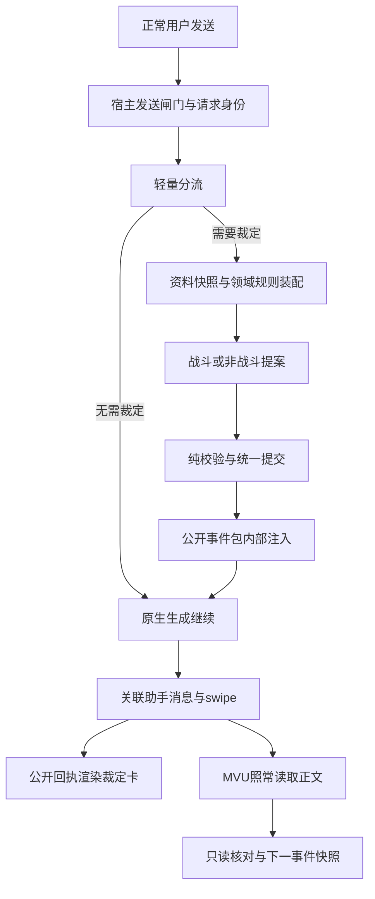

# 默认拦截与事件裁定：实现评估及落地规划

评估日期：2026-10-07。代码基线：`1539601`（本地 HEAD，工作区在本次文档编写前无改动）。本文是实施方案，不代表下述能力已经开发、部署或通过真实宿主验证。

> 2026-10-07 真实 yiyu 前置验证补充：[宿主验证报告](./yiyu-event-p0-validation-20261007.md)。关键能力已实测，但 P0 尚非全项通过：主闸门应优先使用正式 manifest `generate_interceptor`（已验证等待、内部辅助请求不重入、恢复与显式 abort）；`GENERATION_AFTER_COMMANDS` 抛错会被吞、generateRaw 会以 normal 重入，不能直接作完整闸门。取消时用户输入已落为消息、保存 Promise 不代表落盘、旧骰子脚本提前执行等问题必须纳入实现与出口条件。后文原规划中的“未测试”描述是编写当时的证据边界；最新结论以补充报告为准。

## 1. 结论与范围

> 2026-10-07 自动模式实现补充：[自动分流与资料准备框架](./event-automatic-preparation.md)。已添加独立语义分流、领域资料引用提取、四字段 MVU/ACU 只读适配和战斗准备候选；新路径无需人物确认。四字段采用用户最新最小结构，ACU 默认复用全局数据表唯一当前行。本补充不是 P2/P3 全部完成，也未接入自动领域执行和状态同步。

方案可实现，属于一次跨发送入口、领域状态、宿主持久化和消息展示的中大型扩展，不能只靠新增提示词完成。

目标流程：默认接管正常用户输入 → AI 轻量分流 → 按需裁定 → 校验与提交 → 内部注入本轮事件包 → 酒馆主 AI 正常生成 → 在对应助手回复内展示确定性裁定卡。

现有 battle_v2 可以作为第一个领域模块；不应将所有非战斗事件硬塞入战斗回合，也不应直接调用带自动发送副作用的 `BattleController.submit()` 作为通用入口。

第一版闭环范围：正常单人聊天输入；无需裁定时放行；已有战局中的战斗裁定；无对手的定向探查作为第一个非战斗模块；内部事件包；回复内裁定卡；正文重试、删除、swipe 与刷新恢复。新战斗的人物准备作为同一闭环的必要分支。群聊、多角色并行生成和未经验证的第三方自动发送入口须明确标为未覆盖，不能宣称全部拦截。

最终替代 DC 是分领域迁移的结果。某个领域尚未有新规则与校验时，不交给通用 AI 临时猜规则，也不同时运行新旧两套判定。

## 2. 本次核对与证据边界

### 2.1 实际代码

| 文件／函数 | 当前真实能力 | 复用或改造结论 |
|---|---|---|
| `src/host-adapter.js`：`beforeGeneration()`、`start()` | 监听 GENERATION_AFTER_COMMANDS，对已经裁定好的包进行注入；不是异步发送闸门 | 事件通知存在不等于可以暂停／取消宿主生成；必须先核实宿主调用链 |
| `src/host-adapter.js`：`sendQueuedScenePacket()` | 检查已落盘回执和输入框标记，再点击原生发送按钮 | 旧手动战斗流程保留；新流程默认禁止再次点击发送，防止重复用户消息与递归拦截 |
| `src/host-adapter.js`：`injectScenePacket()` | 优先把包追加到输入框；`injectPrompts` 是后备通道 | 新事件流程需要内部注入优先，并禁止失败后把结果回退写入可见输入框 |
| `src/battle-state.js`：`judgeAndCommit()`、`validateAdjudication()` | 裁定、修复、引用与资源检查、对象事务、快照、提交、正文处理耦合在战斗状态机 | 提取无发送副作用的提案／提交接口，保留旧调用兼容封装 |
| `src/combat-ledger.js`、`src/causal-state.js` | 对象归属、依赖、资源占用、revision、幂等与因果状态 | 复用校验原则；非战斗物品、制作产物、长时过程和跨场景生命周期需新协议 |
| `src/scene-packet.js` | 本轮公开事实白名单投影，敌方隐藏招名处理，结果与正文分离 | 复用投影模式，新增通用事件包，不回退到全档案、累计事件和 CoT 注入 |
| `src/battle-controller.js`：`reconcileTranscript()` | 根据用户消息中 XY_BATTLE_PACKET 是否仍存在触发回滚 | 内部注入后没有可见标记，必须改为稳定消息身份与事件回执关联 |
| `src/host-adapter.js`：`scope()`、`writeReceipt()` | 固定助手锚点、message/swipe 存档、保存后回读、版本拒绝、作用域租约 | 适合迁移参考；新输入和没有助手锚点的新聊天不能直接套用 |
| `src/host-adapter.js`：`finishGeneration()` | 用最新助手消息与基线文本比较识别正文完成 | 自动分流、MVU 辅助请求并存时不足；须精确关联 generation/request 与助手 swipe |
| `src/host-display-folding.js` | 将已渲染的 JSON 标记折叠成 details | 不是结果卡；需要新的公开回执投影与渲染器 |
| `src/character-source-adapters.js` | 当前消息 MVU 只读、数据库只读、人物 AI 补全 | 不存在 Registry→MVU 自动桥接，不应在本方案中凭空假定已有双向同步 |
| `src/combat-profile.js` | 规范战斗档案，功法输入以数组为主；要求完整战斗资料 | 新中文“功法名→功法对象→招式名→招式对象”不能直接当数组读取；需要明确转换器 |
| `src/authoritative-rules.js` | 内置六法校验、逐招 ownership、固定规则与反例快照 | 与最新“用户手动维护／整部习得”策略存在接入差异，须有来源选择与整部展开适配 |
| `src/ui/mount.js`、`src/ui/App.vue` | 扩展挂载后有控制器，面板关闭只隐藏 | 新发送入口绑定扩展生命周期，不依赖打开战斗面板；监听安装／卸载需幂等 |

### 2.2 验证结果

- 本次重新运行 `npm test`：142/142 通过。
- 本次重新运行 `npm run lint`：所有源码模块语法检查通过。
- 未修改运行代码，因此没有重新生成 dist 或 third-party 镜像。
- 未调用真实模型、未运行 Playwright、未连接浏览器或修改线上实例。这些测试不能证明新发送闸门可用，也不能证明新分流器的语义质量。
- 宿主证据来自现有代码和 `docs/host-contract-review.md` 引用的本地源码／类型快照。该文档含历史设计与旧接口说明，不将其中计划中的 MVU 写入视为当前扩展已实现能力。
- 本地审查发现 SP/ACU 快照也监听 GENERATION_AFTER_COMMANDS、拦截发送；预设伴生脚本还可能包裹生成。P0 必须核实实际启用插件的顺序和等待行为。
- 新高武十境及六法修订文档不等于已进入内置 JSON。实现前单独对比有效资料；本计划不自动替换功法原文或迁移活动战局。

## 3. 固定产品约束

1. 用户在原酒馆输入框正常发送，不需要先打开扩展。原始文本、附件及已支持的发送参数保持原样。
2. 正常输入默认经 AI 分流；程序仅排除已知非用户请求、dry-run、扩展内部请求及重复回调，不用关键词白名单取代语义分流。
3. 裁定前只显示处理进度，不默认展示结论、损耗、敌方资料或确认面板。资料不足可以进入明确的待补充分支，但不伪造资料以维持表面自动化。
4. 主 AI 负责叙事，裁定器负责已经发生的结果。裁定卡从回执渲染，不能依靠主 AI 复述来保证一致性。
5. MVU 继续从正文提取资料，用户手动维护权威性；不新增 registryId、版本、内容哈希、来源、权威状态、逐招习得字段到用户 MVU 功法结构。
6. 功法已习得时展开该有效功法定义的全部招式；只是听说、获取秘籍但尚未学会时不授予。掌握招式不等于忽略其施展条件或代价。
7. 内部事件 ID、版本和规则快照属于程序实现，不要求用户或 MVU 模型填写。
8. 每个事件最多结算一次；模型返回不是落盘完成；正文失败不能再次扣费。
9. 不把未经支持的领域悄悄交给主 AI自由裁定。应提示未支持，并允许用户明确选择关闭本次接管；该选项不能伪装成“无需裁定”。

## 4. 总体结构与数据流



建议新增独立 `EventCoordinator` 作为外围编排，不将它塞入 Vue 组件或世界书模板。战斗控制器仍管理原工作台，但两个入口必须共用事件队列与提交锁。

### 4.1 发送闸门：先证明能暂停，再实现业务

优先选择实际安装版本中能被等待、能阻止主模型请求的生成前接口。需要记录调用顺序：命令处理、用户消息创建、世界书扫描、提示词组装、模型请求、完成通知。不同版本位置可能不同，不能先写死顺序。

- 若宿主确实 await 某个前置钩子，直接等待分流与裁定，再继续原调用，不重新发送用户消息。
- 若钩子只能通知、不能阻止，不能仅把监听器写成 async 就认为完成接管。应寻找已验证的取消与恢复入口，并证明停止发生在主模型发请求之前。
- 如果两种方式都不能可靠实现，P0 结论为“该宿主暂不支持默认接管”，保留原手动入口；不得用网络请求全局替换、任意延迟或只监听按钮冒充全入口拦截。
- 按钮、Enter、已支持快捷键都走同一 gate。斜杠命令按宿主处理后的实际生成意图接入，纯命令不得变成剧情事件。
- 编辑、重生成、swipe、继续生成使用明确的请求种类；MVU、ACU、路由器、裁定器的辅助请求不得再次路由。不能以“当前恰好正在生成”识别请求归属。
- 初次发送可能没有可写助手锚点：先形成与本次用户消息关联的持久事务身份，再裁定提交。若该宿主不允许这一顺序，需要聊天元数据暂存入口并验证落盘；不能复用演示 session 或上一聊天锚点。
- 闸门 capability 要包含 verified normal-send、resume、prompt-injection、message-metadata、generation-association。开启后默认接管；升级时先迁移配置并显示未满足的能力原因。

### 4.2 分流：判断需不需要，不判断成功失败

输入为原始输入、相关近期上下文、当前事件模式及公开人物／场景摘要。分流器通常不需要敌方秘密档案或六法全文。

建议结构（示例中的 ID 由程序验证或分配）：

```json
{
  "decision": "adjudicate",
  "actions": [{
    "localKey": "a1",
    "domain": "perception",
    "intent": "运转听澜探查门后的动静",
    "sourceSpan": "探查门后",
    "target": "门后区域",
    "dependsOn": []
  }],
  "missingInformation": [],
  "reasonCode": "uncertain_perception"
}
```

`decision` 取 `pass / adjudicate / needs_context / unsupported`。模块名必须在已安装清单内；依赖必须无环；用户输入中的对白、引用、假设、戏外修改不转成真实行动。允许“不要出手”“若被攻击才反击”等否定与条件表达，不能删除条件后执行。

程序限制行动数量、输出长度、修复次数和超时。建议首版最多6个子行动、只允许一次结构修复；超出时保留输入并提示拆分。模型 confidence 仅作诊断，不能当成功率或自动放行的可靠概率。

首次使用建议一套配置模型即可，路由单独限额，裁定加载领域提示词；后续再根据实测选更快的路由模型。路由可用上下文 revision 与请求身份复用同一尝试结果，不能仅凭相同输入文本跨状态缓存。

### 4.3 资料与所有权：适配用户最新 MVU 约定

增加 `normalizeNarrativeProfile()`，显式支持中文功法字典、招式字典、整部掌握状态和用户保留的字段；定义正文缺失时列出缺项，不虚构层数、数量或隐藏招式。不得强制要求已删除的“机制”独立字段；规则可以从定义、完整设定及条件读取。

有效规则来源在设置中选择一次：当前用户维护的资料，或明确选用的内置包。默认尊重当前人物资料；内置同名包不应静默覆盖用户后来修改的定义。将选定规则编译为内部 Registry 快照和程序引用，不把这些字段写回 MVU。同场固定快照，用户更新定义影响下一事件或安全边界后的新战局，不能修改正在返回的裁定依据。

来源相符时复用内置16条联动和反例；用户定义已修改时，旧反例与联动不得继续冒充有效规则。只能使用与当前定义相容的内容，待核对的关系不能猜测补全。

角色长期能力与临时战场对象分别保存。战斗结束不能无差别清空长期伤势、冷却、持续联系；场景对象依据规则失效。现有 `importScene()` 会重建部分状态，不能直接用于“战斗切到疗伤”。

人物准备分级：

- 无需裁定：不调用人物生成。
- 非战斗：只读取该领域需要的档案，不为探查强造敌人、战斗资源表或攻击招式。
- 已有战局：复用当前固定双方档案。
- 新战斗：已明确的正文／MVU 人物可自动规范化；用户管理的主角定义不再逐招弹窗。尚未定义的敌人能力不能在交锋中随意补出，先进入一次资料准备；缺项时才提示编辑，不能自动沿用演示人物。

这要求修改现有“所有人物必须手工确认才能开始”的入口条件；保留可选资料审阅页，并在 P2 验收确认没有默默降低资料完整性检查。

## 5. 裁定与提交协议

### 5.1 提示词拆分

| 提示词 | 负责内容 | 不允许内容 |
|---|---|---|
| router | 意图提取、类型、依赖、缺项 | 决定成败、增加行动、编造资源 |
| common-adjudication | 依据规则、区分事实与意图、公开边界、提案格式 | 剧情创作、世界规则临场重写、DC总分 |
| combat | 现有功法攻防、敌方反应、战场对象 | 替代用户选择攻击意图、因高境界无条件抹除机制 |
| perception | 探测手段、范围、阻隔、情报可信程度 | 把未发现写成必然不存在、泄露内部真相 |
| recovery / pursuit / formation | 恢复、追逃、阵法领域规则，后续增加 | 无定义的恢复比例、移动收益、破阵成功率 |
| cultivation / crafting | 突破与成长、材料和产物、长时过程，最后接入 | 沿用旧哈希骰／DC同时重复结算 |
| story-bridge | 主预设中的结果不可复判、未裁定行动边界 | 在每个事件包塞入长篇写作指令或 CoT |

不把“模块”机械等同于一次模型请求。同一紧密交锋加载多个能力规则，由一个裁定器综合处理。仅可分离的多阶段事件才顺序调用；全部模块在同一临时状态上演进，不能对旧快照并行扣除同一份资源。

### 5.2 内部事务记录

拟议 `event_v1` 最小字段：

```text
eventId, requestId, chatId, branchUid, inputMessageUid, inputRevision
generationKind, origin, originalInputHash, baseRevision, parentEventId
route, sourceSnapshotRef, ruleSnapshotRef
beforeState, proposal, committedAfter, publicResult, packet
status, attempts, generationBindings[], mvuObservation
```

这些字段只在程序内部持久化。模型不能自行指定有效 chat、branch、revision 或存储路径。`inputRevision` 包括输入与受支持附件的身份变化；相同文本第二次真实发送是新的行动，不能仅以文本哈希去重。

建议状态机：

```text
captured → routing → preparing_context → adjudicating → validated
         → committed_pending_story → generating_story → completed
```

独立分支：`passed / needs_input / unsupported / cancelled / rejected / persistence_pending / narrative_failed / rolled_back`。MVU 观察采用独立状态 `pending / observed / mismatch`，不把“正文完成”当成“MVU已落盘”。

### 5.3 校验与恢复

- 模块返回提案，不调用宿主写入、发送、UI弹窗或 MVU写入。
- 在同一 beforeState 的临时副本上试运行所有变更。校验资源上下限、所有权、对象引用与依赖、合法状态转移、耗时、隐私、重复操作以及 baseRevision。
- 不支持的操作或缺少关键事实必须拒绝或待补充，不能局部提交后继续后续模块。
- 验证后一次写入事件与领域状态，宿主确认落盘并回读后才允许主 AI 请求。未确认时保留候选提交，阻止下一行动，不重新裁定。
- 重试正文复用已提交结果；重试持久化复用同一提交；同一请求最多一次生效。
- 每聊天／分支串行队列覆盖手动战斗入口和自动入口；多标签默认只有一个可写拥有者。浏览器内锁不能保证跨设备一致，首版明确限制同聊天单写入者，并用读回版本识别冲突，不宣称分布式原子事务。
- 长过程分成有意义的阶段事件。探查失败、NPC抵抗或修炼失败是合法事件结果；JSON错误、超时或引用错误属于基础设施失败，两者不能混为一谈。

程序仍不能证明每句自然语言机理推断正确。输出增加简短的规则依据、成立条件与抵抗结果即可，不要求可见思维链。

## 6. 内部事件包与回复内裁定卡

### 6.1 事件包

拟议 `EVENT_SCENE_PACKET / event_scene_v1`，保留旧包兼容转换，单次请求只注入一份：

```json
{
  "type": "EVENT_SCENE_PACKET",
  "schema": "event_scene_v1",
  "eventId": "由程序分配",
  "category": "perception",
  "action": "运转听澜探查门后动静",
  "result": {
    "outcome": "partial",
    "summary": "察觉门后有灵力活动，未确认人数与身份",
    "effects": ["获得一条尚不完整的感知线索"],
    "reactions": [],
    "costs": [],
    "elapsed": null,
    "environment": "无变化",
    "boundaries": ["未确定目标身份，未发动攻击"]
  }
}
```

以上只是格式示例，不是对具体功法能力的新定义。空 costs 表示本包没有公开列出代价，不自动解释为零消耗；耗时未知保留 null，不能补成一个回合或一分钟。

从同一个公开 `publicResult` 同时生成事件包和裁定卡。隐藏敌人能力、内部失败原因、私密资源、推理、原始模型响应和全量账本不进入二者。内部成功率／真实陷阱存在也不能通过标题或状态色泄露。必要时公开 outcome 使用 unknown，由有限视角描述结果。

主角功法给名称与本轮动作摘要，敌方或非战斗障碍给本轮实际可公开的交互。禁止复制旧人物常态、全部功法、累计战报或完整事件包的字符串套娃。

### 6.2 注入与世界书召回

新流程内部注入优先，保留原始用户文本。必须实际核实注入发生在主模型请求构建之前；不能只用“注册了 injectPrompts”证明已发送。

现有后备注入设置 `should_scan:false`。若不再把包写进用户消息，功法名可能不参与世界书召回，而当前主角包又不含完整定义。新流程必须解决这一依赖：

1. 优先使用经过验证的世界书扫描入口，把本次公开功法／招式名称作为扫描上下文；
2. 若只能使用可扫描提示词，则只扫描精简公开名称，不扫描内部账本和敌方秘密；
3. 若宿主不支持上述方式，直接装配本轮必要公开规则摘要；不能宣称世界书已经召回。

路由与裁定模型的上下文由扩展自行装配，不依赖主 AI 的世界书扫描自动共享。模板脚本、正则、摘要压缩和伴生脚本可能改变最终主请求，需检查最终请求里原始输入与事件包各一次。

新增主预设桥接规则：只描写已提交交锋／事件；不能在结尾擅自追加新命中、追击、治疗收益或NPC实际伤害。NPC可以表达下一行动意图，真正影响状态的后续行动进入下一事件。这样才能防止裁定前置后，主 AI 又在正文末尾制造第二次未裁定交锋。

### 6.3 确定性裁定卡

- 新增 `host-event-card.js`，以 `assistantMessageUid + swipeIdentity + eventId` 定位；从宿主事件回执读取数据。
- 默认主 AI 正文完成且关联成功后，在该回复正文前插入折叠卡，显示“事件类型、公开结论、关键影响、已公开代价与耗时”。流式生成期间只显示中性进度，不先亮出结果。
- 卡片不展示 DC分数、哈希骰、内部编号、规则ID、confidence或CoT。视觉参考现有 DC 面板，结构使用新的事件卡，不能伪填旧三才字段来套正则。
- 使用固定 DOM 模板和 textContent／转义文本，不执行模型返回的 HTML。重复渲染、主题切换、历史加载、swipe和刷新都按稳定 key 更新，不能重复插卡。
- 卡片默认仅是 DOM 展示，不追加到 `message.mes`，以免污染历史提示词与 MVU 文本分析。事件数据保存在消息元数据，卸载扩展后正文仍正常可读；跨设备只有安装兼容扩展才能重建同款卡。
- 生成失败不发布成功卡，显示可重试的中性状态。用户主动打开事件记录可查看已提交的公开结果，但系统不提前弹出。
- 卡片与回执的一致性可由程序保证；正文是否每句遵守结果仍需模型验收。第一版不默认增加一次全文AI审校请求；对已发现矛盾可复用同一包重写，不再次裁定。

## 7. MVU 与领域状态：保持正文提取架构

不开发上一轮建议的 Registry→MVU 写回桥接。新扩展对 MVU 默认只读；能力定义和长期资料按用户当前保存内容读取。

| 数据 | 决定／保存方式 | 同步边界 |
|---|---|---|
| 功法定义、人物长期资料 | 用户维护的 MVU／明确选用资料 | 编译成本事件内部快照，不增加 MVU技术字段 |
| 本轮成败与已提交消耗 | 扩展事件回执与领域状态 | 主 AI 必须准确表达；MVU照常从正文反映结果 |
| 本场节点、占用、持续效果 | 扩展账本 | 不要求MVU从叙述重新构造对象关系 |
| 日常非裁定变化 | 原有正文→MVU流程 | 下一事件读取最新分支资料 |
| 卡片 | 公开回执投影 | 不作为第二份可结算的正文 |

同一资源在扩展内部先结算，再被 MVU反映，并不应成为两次增减。需要新增只读对账：

1. 固定事件前 MVU 快照和扩展状态 revision；扩展保存本次 before/after。
2. 正文完成后，等待实际 MVU 更新结束并读取对应助手消息／swipe；不能监听一个全局结束事件就认定是本次更新。
3. 对本次明确写出的资源检查期望终值，不能把读取到的 MVU after 当新增量再次扣除。定性消耗没有数值时不自行量化。
4. 更新尚未完成时，下一步可以编辑输入，但不能在需要该资源的事件中用旧 MVU覆盖已提交状态。
5. 若对应字段不一致，保留事件结果，提示同步差异；按用户手动维护策略修正MVU或显式采用人工修订，不静默覆盖整份MVU。
6. 并非所有手工编辑都是冲突：无待同步事件且当前分支明确的用户修改，在下一安全边界重新建立基线；修改规则不改写历史裁定。

扩展回滚只保证自身状态恢复；MVU是否随宿主删除／swipe恢复必须单独验证。无法确认时标为待同步，不能宣称跨组件事务原子性。

## 8. 稳定身份、重试与回滚

新记录使用程序分配的用户消息UID、助手消息UID、swipe身份和分支谱系；数组楼层只是查找坐标。`branchUid` 不能仅用 `message:<index>:swipe:<number>` 代替，数字会因删除和插入漂移。

建议保留旧 `extra.battle_v2`，新增命名空间 `extra.xy_event_v1`。用户消息保存事件输入身份和提交回执（首次发送前若需要暂存，则由P0确认聊天元数据入口），助手 swipe保存对该回执的引用与显示所需公开投影。跨消息写入并非原子：提交回执是恢复基准，助手关联可幂等补写；恢复时不能凭一张卡认为提交成功。

| 操作 | 预期行为 |
|---|---|
| 用户再次真实发送相同文字 | 新 request/event，按最新状态处理 |
| 重复发送回调或双击 | 同一请求只发一次主请求、结算一次 |
| 路由／裁定过程中停止 | 中断辅助请求并释放闸门；不提交，不丢失原输入 |
| 提交后正文失败／停止 | 状态保留，重试正文复用结果；未完成文本不触发第二次MVU结算 |
| 只重生成或删除助手正文 | 输入事件仍存在，默认不退资源；重新关联正文和卡 |
| 删除产生事件的用户消息 | 撤销该事件及所有依赖其状态的后续事件，恢复前快照；残留正文不得用于重建当前事实 |
| 修改历史输入 | 校验 inputRevision，标记受影响后续链失效；禁止拿旧裁定对应新文字 |
| 切换助手swipe | 纯文风重写引用同一裁定；若各swipe有不同后续剧情／MVU状态，后续事件沿各自谱系隔离 |
| 用户明确要求重新裁定 | 作为新分支／替代事件处理，撤销依赖链后重建，不能覆盖同一个已提交ID |
| 刷新／浏览器重开 | 从持久回执恢复；已提交无正文的事件进入待重试，不自动再扣费或发送 |
| 切聊天后旧请求返回 | 校验 scopeEpoch／requestId，结果丢弃，不写新聊天 |

旧输入框包继续走旧识别逻辑；新事件必须按元数据存在性与谱系核对。不能把“没有XY_BATTLE_PACKET”解释为新事件已被删，也不能因内部注入不留标记就永久跳过回滚。

## 9. 分阶段实施与出口条件

工期仅为代码开发与离线验证的粗估，不含真实模型反复调参、用户验收等待及未发现的宿主兼容工作。

| 阶段 | 具体交付 | 依赖／出口条件 | 粗估 |
|---|---|---|---|
| P0 宿主接管验证 | `host-generation-gate.js` 原型、宿主版本能力记录、调用顺序夹具、冲突插件清单 | 正常发送能等待异步处理；主请求未提前发出；恢复不新增第二条用户消息；停止有效 | 2–4人日 |
| P1 事件身份与生命周期 | `event-state.js`、`event-store.js`、`event-coordinator.js`、请求种类与锁、稳定UID、独立回执 | 无裁定放行、取消、刷新、保存失败及跨聊天测试通过；无助手锚点可处理 | 3–5人日 |
| P2 资料与规则适配 | 中文功法字典转换、整部习得展开、用户资料优先策略、按领域最小资料、新战斗准备分支 | 不要求MVU技术字段；不自动授予未习得六法；用户定义不被内置包覆盖 | 2–4人日 |
| P3 路由＋战斗模块 | `event-router.js`、路由提示词、`modules/combat.js`；从战斗核心拆分提案与提交，统一自动／手动队列 | 一条用户攻击只裁定一次、原生生成一次；普通聊天只分流；战斗进退与下一回合规则明确 | 3–5人日 |
| P4 包、卡与完整恢复 | `event-packet.js`、`host-event-card.js`、一次性注入、世界书扫描支持、正文绑定、只读MVU对账、事件谱系回滚 | 卡与公开回执一致；主请求包一次；重生成不重扣；删除事件正确撤销；刷新恢复 | 4–6人日 |
| P5 首个非战斗模块 | `modules/perception.js`、无敌人探查协议、情报对象与生命周期、模型案例集 | 无需完整战斗档案；未发现不等于不存在；知识边界正确 | 2–3人日 |
| P6 逐域替代DC | 疗伤→追逃／破阵→修炼突破→炼丹炼器；各自规则、状态与迁移 | 每个领域分别验收后切换唯一执行权；覆盖旧DC入口后才宣布完全替代 | 单领域约2–5人日，成长／制作另评 |

P0–P5 首个可用闭环粗估16–27人日。P0完成后重估，不将该区间作为交付承诺。不要先上自动拦截，再把回滚和消息关联留作后补。

实现提交建议沿P0–P5拆分，前置模块先做纯函数和夹具，再接宿主。旧手动功能在兼容层维持可用；关闭自动入口只停止新接管，不删除已有事件和卡片。

### 文件变更清单

新增：

- `src/host-generation-gate.js`：等待、恢复、取消和宿主能力检测。
- `src/event-coordinator.js`、`src/event-state.js`、`src/event-store.js`：事务队列、请求状态机、回执与恢复。
- `src/event-router.js`、`src/event-prompts.js`：分流与通用契约；专项提示词可在模块目录维护。
- `src/event-context.js`、`src/narrative-profile.js`：资料快照、中文MVU结构转换、规则来源及已习得展开。
- `src/event-modules/combat.js`、`perception.js`：模块输入、提案、领域校验。
- `src/event-packet.js`、`src/host-event-card.js`：公开投影、一次性注入与确定性展示。
- `src/event-mvu-observer.js`：只读匹配本次MVU更新和资源终值，不负责写MVU。
- 对应 schema、离线测试、真实模型验收样例和宿主手测清单。

修改：`battle-state.js`（提案／提交解耦）、`battle-controller.js`（手动入口适配协调器）、`host-adapter.js`（精确生成关联与内部注入）、`battle-rollback.js`（兼容事件恢复）、`combat-profile.js`／`authoritative-rules.js`（新资料来源与绑定策略）、`adapters.js`及设置UI（路由、模块配置）、`ui/mount.js`（单次安装入口）、样式与最终分发构建。

不在本次计划阶段修改任何上述运行文件。未来构建沿项目原流程同步 dist 和 third-party，不能只改分发目录。

## 10. DC与预设切换清单

1. 战斗新入口验收后，停用世界书[12]战斗DC差值、法宝通用加点及相关强制覆盖。人物境界保留，旧DC可作为历史文本，不再输入有效裁定规则。
2. 世界书[22]旧开战标签协议改成新事件入口适配；已提交事件不再停在开战前。旧手动路径仍保留兼容能力，不让两个引擎处理同一动作。
3. MVU规则中的气运DC阈值、器物DC门槛等也要迁移到具体规则；只删[12]不足以完成替代。
4. 非战斗未迁移领域保留唯一旧入口或明确未支持。尤其[16]突破脚本与预设“三才法则”只能有一个实际执行者。
5. 修炼／制作模块接管后再停用对应旧脚本、哈希骰和旧面板生成。旧历史DC面板继续可读，新结果使用独立事件卡。
6. 主预设增加短桥接协议，写作指令留在预设。原有思维链、伴生脚本、摘要正则是否兼容，在P0/P4检查，不借本方案擅自全量重写。

## 11. 验收矩阵与效果评估

### 11.1 程序验收：必须全通过

| 类别 | 必测案例 |
|---|---|
| 入口 | 点击／Enter；首条消息；无助手锚点；dry-run；命令；原始文本与附件保留；停用扩展正常发送 |
| 防递归 | 路由／裁定／MVU／ACU请求不重入；自动恢复一次；重复挂载无双监听；手动战斗与自动入口互斥 |
| 路由契约 | 未知模块、循环依赖、过多行动、超时、无效JSON、否定与引用不丢失；失败不默认为pass |
| 资料 | 字典功法读取；整部习得展开；未习得不授予；用户手改生效；未知名称不造定义；规则更新不污染历史 |
| 提交 | 资源重复消费、悬空对象、过期before、保存失败、中途取消、并发请求均不导致部分提交 |
| 注入 | 原始输入不变；事件包一次；正常预设／世界书仍在；不携带敌人秘密；结束／停止／切聊天清理 |
| 显示 | 正文完成前不展示结论；公开卡与回执一致；刷新／swipe／重复渲染无重复卡；卡不进入message.mes |
| 生命周期 | 正文失败重试不重扣；删正文不撤销事件；删用户事件撤销依赖链；编辑旧输入不复用旧结果；A/B不串状态 |
| MVU | 异步完成不串请求；新终值不再次当增量；MVU尚未更新时不读回旧资源；分歧提示；无写回API调用 |
| 兼容 | 现有142项回归不退化；旧battle_v2存档、输入框包、手动面板与导入导出保持可恢复 |

### 11.2 模型语义验收：单独统计

建议固定至少100条路由样例，覆盖普通对话、否定、假设、戏外修改、隐含攻击、治疗、侦查、混合行动及续战；按场景报告误拦与漏判，不只报总体准确率。至少30条裁定案例，其中包含实际六法边界、受阻探查、无伤战斗和并行资源竞争。

候选发布门槛：路由样例总体正确率≥95%，关键资源／伤害行动的固定样例无漏判；程序防重与隐私夹具100%通过；模型测试无擅自新增能力或公开秘密。数值只是验收目标，不是当前已达到的效果。记录模型、提示词版本、规则快照及多次运行差异。

延迟记录路由、资料装配、裁定、校验落盘、主AI首字、正文完成各段P50/P95。无裁定输入通常多1次路由调用；已有资料的裁定输入通常多1次路由＋1次裁定；新敌方资料构建另计。未实测前不承诺秒级响应或具体费用。

### 11.3 用户真实环境验收

按用户约定不使用Playwright；先完成离线夹具和接口核对，再提供逐步手测清单由用户在真实ST执行。重点检查：主请求是否提前发出、原始消息是否重复、停止是否真正取消、世界书是否召回、MVU是否更新、删除是否恢复、卡片是否挂到正确回复。未完成这一步，发布说明只能写“代码与夹具通过”，不能写“默认接管已在真实环境验证”。

## 12. 第一项可执行任务

先完成P0发送闸门与请求身份原型：只等待一个可控的本地异步结果，再恢复原生生成，不接真实路由模型、不扣资源、不改世界书。形成可审阅的宿主调用顺序与兼容证据。

P0通过后依次推进事件持久化、资料适配、路由和战斗复用。将P4回滚与确定性卡纳入首次可用版本，P5探查证明领域扩展成立。达到各领域验收门槛后，再按清单撤去相应DC规则。
