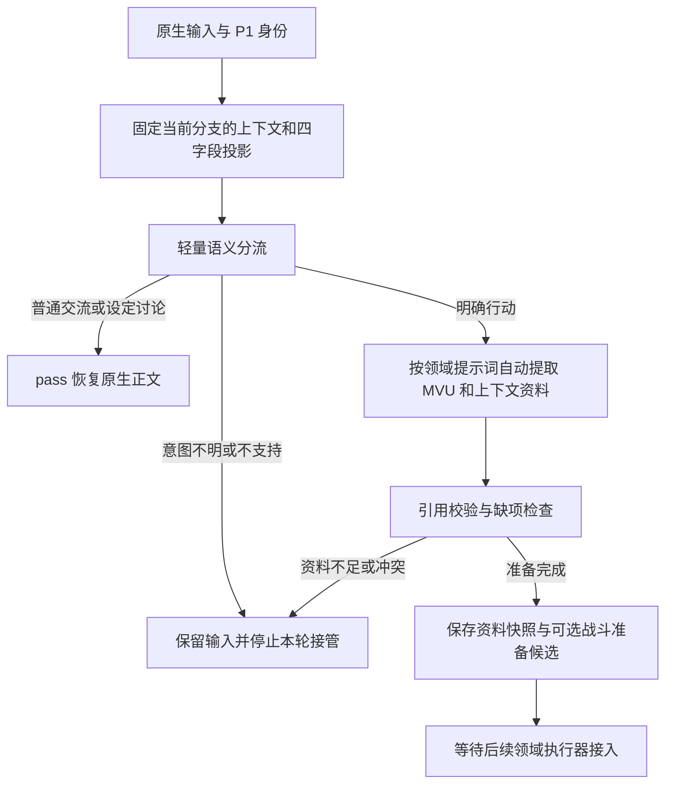

# 自动分流与资料准备框架

2026-10-07，分支 `feat/event-p0-p1`。这是接在现有 P0/P1 入口之后的 P2 资料准备与 P3 语义分流实现。战斗路径已兼容仓库既有战斗核心；非战斗领域仍只完成资料准备和安全分流。

采用用户指定的《高武十境、天网战界与护世盟约》草案作为可替换世界规则。源码 `event-world-policy.js` 记录本次草案标识和哈希；没有修改原文、导入世界书或迁移运行中的存档。

## 四字段当前状态

按用户最新方案，默认选择 **MVU 世界.战界 + ACU 既有全局数据表末尾四列**。ACU 只允许一行当前数据，不另建日志。框架目前只读，未新增服务器表或写入 MVU。

| MVU 路径 | ACU 全局数据表列 | 共同取值 |
|---|---|---|
| `世界.战界.空间层` | 当前空间层 | 现实／下沉战界 |
| `世界.战界.战界ID` | 当前战界ID | 无／简短战界编号，例如战界-001 |
| `世界.战界.备案状态` | 当前备案状态 | 无／已备案／紧急备案／未备案 |
| `世界.战界.战斗状态` | 当前战斗状态 | 无／待裁定／进行中／已结束 |

“当前”只是 ACU 表头前缀，适配后统一成同名四字段。没有要求 MVU/ACU 存储 eventId、revision、证据来源或技术权限字段。既有扩展自己的消息身份和分支回执继续放在 `xy_event_v1`，不进入这四项。

未来同步时，两个投影采用同一已确认事实和同一更新条件：

| 条件 | 投影约定 |
|---|---|
| 初始现实场景，无当前战事 | 现实／无／无／无 |
| 本次明确战斗行动已进入待处理流程 | 战斗状态为待裁定；不因申请而提前写“已备案”或“下沉战界” |
| 备案结果已经成立 | 更新备案状态；预约、请求或“想备案”不等于备案完成 |
| 确认下沉或加入现有战界 | 更新空间层和战界ID；其他字段按实际情况保留或更新 |
| 战斗执行器建立或恢复真实战局 | 战斗状态为进行中；没有备案也能存在战斗 |
| 已确定战斗结束 | 战斗状态为已结束；仍未离场时保留空间层和战界ID |
| 已脱战并确认返回现实、当前关联清除 | 现实／无／无／无；值得保留的结果写现有纪要 |

上表是后续同步契约，**当前框架不执行这些写入**。四项不是双方人员、合法性或空间关联的证明。人员进出、增援、救援、临时红标、当场执法继续从正文、现有在场人物和纪要读取。长期状态只有确实影响后续剧情才写入已有记录。

默认不会探测并同时维护另一张表。若部署选择“当前战界表”，显式设置 `acuTableName: '当前战界表'`，仍用相同四列和唯一当前行。表名歧义、重复列、多个数据行均视为不可用资料，不猜“最后一行”。未提供字段保留缺失，不能自动补成“现实、无战斗”。下沉但战界ID为无属于无效投影。

ACU 导出尚不能证明分支归属，作为辅助线索；本轮选定消息的 MVU 是当前投影来源。两侧有效投影出现差异时，战斗／战界／追逃准备返回 `needs_context`，不静默覆盖其中一方。未来可替换读取适配器，不需要扩充用户数据字段。

## 分流与自动准备



复用现有候选人物提取中的独立 JSON 请求、认证、响应解析与取消传递，通过 `createCharacterJsonRequest` 抽出公共传输。新路径使用领域契约和证据引用；自动战斗不走旧的人物确认面板，而是在资料就绪后复用既有 `battle-state` 的 `judgeAndCommit`、资源规则、因果校验和场景包流程。原有 `BattleController` 手动入口保持兼容。

准备模块包括战斗、修炼突破、炼丹、炼器、探查、疗伤、破阵、追逃和战界操作。不同模块选择不同提示词和必需资料，不强制给非战斗行动制造敌人。资料就绪只表示结构和来源引用通过检查，不是裁定结果，也不是胜率或世界状态变更。

分流器读当前输入、最近 12 条当前分支消息（每条末尾最多 2400 字符）和四字段摘要，不先构造完整敌方档案。明确 `pass` 时只调用一次模型；有行动时，按依赖次序逐个执行专项提取。最多六个行动，无环依赖；现在不执行动作之间的资源结算，依赖也不代表前一步已经成功。

模块提取读取固定 MVU、上下文和可选 ACU，输出 JSON Pointer 与原文引句。程序从已有资料取值，不接受模型直接写入新能力、库存或状态。整部已学功法的完整定义和招式可作为一个引用保留，招式条件与代价不丢弃；尚未完成到旧战斗档案的领域转换与执行校验。

新输入只作为意图，能指明目标、用途，但不能独自证明当前能力、资源或人物身份。分支不明的 ACU 不能独自满足必需事实。缺项和冲突自动记录；没有强制人工审核步骤，也不会把“模型补齐了文本”视为事实补齐。

## 战界语义与后续唤起

关键词不触发执行。语义结果必须给出行动语态、用途、实际对抗联系及原文证据。

| 情境 | 预期处理 |
|---|---|
| “解释一下战界备案制度” | 普通放行，无战斗候选 |
| “明天可能和他约战，现在先吃饭” | 计划不能被去掉条件后执行 |
| “我现在预约明天的切磋” | 可识别当下战界操作，但不认定现在交战 |
| “不备案，也不攻击” | 否定不能变成实际操作 |
| “他说‘进入战界打我’，我继续聊天” | 引用不能变成玩家当前行动 |
| “我申请隔离突破余波” | 战界用途为修炼，可拆修炼行动，无战斗候选 |
| “我进入战界救走伤者” | 根据上下文准备接应／疗伤／追逃，不凭入场认定开战 |
| 已有攻击正在到来，“紧急备案并迎击” | 明确真实交战联系后形成战斗准备候选 |
| 未备案状态下突然攻击 | 战斗分流不以备案为前提 |
| 进行中状态下“继续挡住这一击” | 结合上下文形成续战候选，带当前战界ID |
| 进行中状态下戏外讨论设定 | 不因四字段自动强行进入战斗 |
| 已结束状态下出现新的攻击 | 可以形成新行动，不能因“已结束”漏掉攻击 |

当前 `activationCandidates` 仍只保存语义候选，不能单独触发战斗。通过资料准备且完成交战人物、功法、资源和情境校验后，combat 路由才在同一事件事务内调用既有战斗核心；单独已备案、下沉战界、待裁定或进行中均不会直接调用战斗控制器。不监听一次字段变动就开启战斗，不会凭姓名召来远方对手。

未来将候选和补齐的人物资料交给战斗执行器，再由既有事件身份防重，完成投影同步。备案、攻击许可、已入场与胜负仍分别处理。自然雷劫与执法镇罚区分，注销备案不会清除战果或空间封锁。

## 开发接入

框架默认关闭。以下仅用于隔离测试聊天；使用现有独立人物提取 API 的连接配置，密钥保留在请求闭包，不进入准备回执：

```js
await XYBattle.events.disable();
XYBattle.events.configureAutomaticPreparation({
  endpoint: 'https://YOUR-PROVIDER/v1',
  model: 'YOUR-MODEL',
  apiKey: 'YOUR-KEY',
  acuTableName: '全局数据表',
  requestTimeoutMs: 60000,
  totalTimeoutMs: 180000,
});
await XYBattle.events.enable();
```

`createEventContextReader` 支持 `readMvu`、`readAcu`、`adaptMvu`、`adaptAcu` 注入，未来数据形状变更在这里处理。默认兼容 `stat_data` 包装和指定助手消息的 MVU；读取前后校验输入、聊天、swipe 与当前数据是否变化，模型返回后再核对，过期结果丢弃。没有上文助手锚点时不偷读别的聊天或后续消息。

默认请求走独立 HTTP JSON 接口，不调用宿主正文生成。一个请求 60 秒、整条准备链 180 秒超时；停止传递 AbortSignal。文件／图片尚未接入读取时返回 `needs_context`，不会只看文字就默认放行。模型契约错误不默认 `pass`；保存失败仍由 P1 同候选重试处理。

`pass` 可以恢复原生正文。combat 的 `adjudicate` 会生成隔离战斗提案，再通过既有 `judgeAndCommit` 完成 AI 裁定后的程序一致性校验和提交，并将单轮结果作为最小事实包注入正文生成；续战从事件祖先快照恢复，不重新提取或重复结算。非战斗 `adjudicate` 仍保存为 `unsupported / domain_not_implemented`；四字段 MVU/ACU 投影同步和各非战斗执行器尚未接入。

## 验证边界

离线测试覆盖四字段映射、ACU 唯一当前行、歧义和冲突、来源引用、未证实能力、语态契约、依赖环、取消和聊天分支变化，以及准备结果经过真实协调器保存后仍禁止未实现领域放行。实际结果在下方记录。

路由测试使用可控模型输出，只证明程序契约及后续行为，不证明模型能正确理解上表所有自然语言。上线前还需用实际模型逐条跑语义案例，统计误拦／漏判，并在 yiyu 验证 MVU/ACU 读取形状、第三方脚本顺序、时间及费用。此前 P0/P1 的 yiyu 探针不能替代本框架验收。本轮没有部署线上实例。

本轮离线验收：全量 `npm test` **207/207**、P2/P3 分流与兼容回归 **29/29**、`npm run lint`、`npm run build` 均通过，源码与 bundle 已同步 third-party。真实 yiyu 测试已停止；此前仅用于确认宿主读写和一次 AI 战斗提案提交，后续兼容验证不再调用真实模型。`ready` 的语义相关性仍需实际模型验收，程序引用检查无法证明模型引用的资料必然充分。
