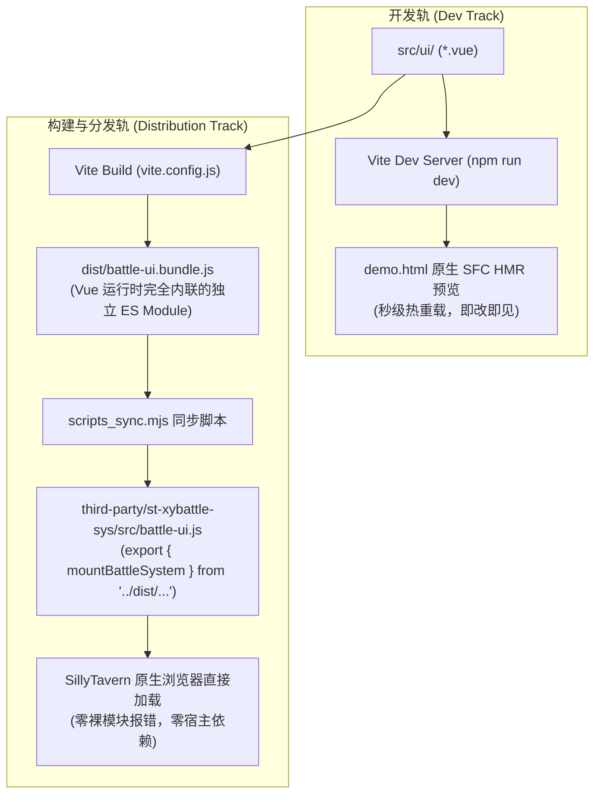
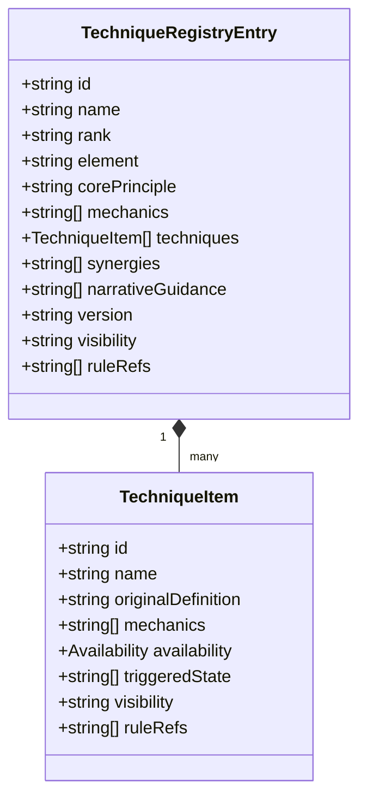

# st-xybattle-sys 全系统交接与前端架构演进文档

> **版本**：v0.2.0 (dev)  
> **更新时间**：2026-10-04  
> **适用对象**：接手系统架构师、前端开发工程师、SillyTavern 插件维护者

---

## 目录

1. [项目背景与系统设计哲学](#1-项目背景与系统设计哲学)
2. [前端架构演进与现代框架选型对比（Preact vs Vue 3 vs Svelte）](#2-前端架构演进与现代框架选型对比preact-vs-vue-3-vs-svelte)
3. [双轨分发机制与构建管道（Dual-Track Architecture）](#3-双轨分发机制与构建管道dual-track-architecture)
4. [前端 UI 组件拓扑与响应式状态流](#4-前端-ui-组件拓扑与响应式状态流)
5. [领域核心：六法与三宝结构化注册表](#5-领域核心六法与三宝结构化注册表)
6. [两阶段调用模型与 SillyTavern 宿主集成契约](#6-两阶段调用模型与-sillytavern-宿主集成契约)
7. [测试覆盖、质量守门与安全合规边界](#7-测试覆盖质量守门与安全合规边界)
8. [运维、操作指引与常见问题排查（Runbook）](#8-运维操作指引与常见问题排查runbook)

---

## 1. 项目背景与系统设计哲学

`st-xybattle-sys`（独立 `battle_v2`）旨在为 **SillyTavern**（酒馆）提供一套高可信、低耦合、强规则约束的修仙回合制战斗裁定与交互系统。

### 1.1 核心痛点与旧架构缺陷
在传统酒馆战斗生态中，普遍存在以下设计缺陷：
- **Prompt 模板严重污染**：将厚重的战斗规则、数值状态全量混入全局主设定，不仅挤占有限上下文窗口，还引发大模型幻觉与能力衰减。
- **正文生成与胜负裁定混淆**：依赖单一模型在同一段正文输出中“边讲故事边判定胜负”，导致模型倾向于“无脑开大”、“无视前置状态”或“强行反转逻辑”。
- **状态持久化脆弱**：通过正则暴力改写消息历史或依赖全局全局变量，极易在分支回滚（Swipe A/B）、历史楼层切换时发生状态串扰与数据崩坏。

### 1.2 `battle_v2` 设计四铁律
1. **完全解耦与非侵入**：系统自行管理独立根节点（Shadow-like Floating Seal & 独立横板工作台），绝不篡改宿主主提示词模板、不破坏第三方扩展 DOM。
2. **两阶段调用分离**：
   - **阶段一（严谨裁定）**：纯结构化上下文输入，由裁定器（OpenAI-compatible / Mock）进行白盒推演，返回变更状态（`before`/`after`）、规则引用（`ruleRefs`）与可见事实。
   - **阶段二（剧情正文桥接）**：通过一次性 `BATTLE_SCENE_PACKET`（场景包）桥接注入，携带明确指令：“**所有因果已经提交，禁止重新裁定本轮行动，禁止凭空新增隐藏数值**”。
3. **严格分支隔离与幂等**：会话以 `chatId + branchId` 强绑定。重试同一 `actionId` 严格幂等；历史快照不可篡改。
4. **绝对安全边界**：
   - **零凭据落盘**：API Key 仅驻留运行时内存，严禁写入 localStorage、消息 `extra`、导出文件或日志。
   - **严格投影脱敏**：敌方 `hidden`、未观察内部词条与资源在玩家视图（`getPlayerView`）与公开战报日志中绝对抹除。

---

## 2. 前端架构演进与现代框架选型对比（Preact vs Vue 3 vs Svelte）

### 2.1 抛弃原生命令式 DOM 的必然性
在原型阶段，UI 曾以原生 JavaScript + 模板字符串编写（单文件 25KB+ 的命令式逻辑）：
- **状态与 DOM 手动绑定失控**：血条、真元条、架势条、5 瓣太音翼羽、场地效果、行动台、词条模态窗、时间轴抽屉等多达数十处高频交互。每次状态微调需要几十行繁琐的 `document.querySelector`、`classList.toggle` 与 `innerHTML` 拼接。
- **重绘开销与视觉残影**：状态更新时频繁全量覆写 DOM 节点，导致 CSS 动画被掐断、输入框焦点丢失、花瓣光效突兀重置。
- **可维护性与扩展性危机**：缺乏组件隔离，样式与逻辑高度偶合，无法支持后续多角色、法宝协同动效及自适应布局。

引入现代前端框架 + 自动化构建工具是工程演进的必然要求。

### 2.2 框架横向评测与权衡矩阵

针对 SillyTavern 浏览器插件环境的特殊性（**无 Node.js 运行时、宿主通过 ES Module 原生 `import()` 静态目录加载、避免外部大型运行时污染**），我们对 **Preact**、**Svelte** 与 **Vue 3** 进行了深入推演对比：

| 评估维度 | 方案 A：Vite + Preact | 方案 B：Vite + Svelte (v4/v5) | 方案 C：Vite + Vue 3 (最终选用) |
| :--- | :--- | :--- | :--- |
| **运行时体积** | 极小（~4 KB gzip） | 趋近于零（编译时消除运行时） | 中等（完整打包 ~110 KB gzip） |
| **组件心智与 DSL** | JSX / TSX；需额外引入 Hooks 状态流 | `.svelte`；编译期静态响应式 | `.vue` 单文件组件 (SFC)；`template + script setup` |
| **游戏/战斗 UI 契合度** | 一般。JSX 书写复杂嵌套样式与动效结构较繁琐 | 极高。指令清晰，过渡动效内置友好 | **极高**。条件渲染 (`v-if`)、列表过渡、动态 Style 深度贴合横板布局与花瓣系统 |
| **响应式引擎** | 基于 Hooks / Signals，对象深层变动需手动更新 | 编译时依赖赋值 (`$:` / runes)；对于复杂层级对象追踪偶有边角问题 | **Proxy 细粒度响应式**（`reactive`/`shallowReactive`），可与战斗状态机深层状态天然无缝同步 |
| **打包分发无缝度** | 依赖 JSX 编译；单模块输出成熟 | 需配置自定义编译器与分发包装层 | **官方 `@vitejs/plugin-vue` 极速集成**，Rollup/Vite 产物单文件 ES 导出极为健壮 |
| **外部生态与图标库** | Preact-lucide 等 | lucide-svelte | `lucide-vue-next` 无缝配合，图标丰富度与修仙玄幻视效高度契合 |

### 2.3 为什么最终选用 Vue 3 SFC？
1. **天然贴合状态机的声明式模板**：战斗系统具有高度离散的状态阶段（`idle` -> `awaiting_player` -> `judging` -> `committed` -> `narrating` -> `ended`）。Vue 的模板指令能够以最直观的语法表达各种条件下的组件展现与切换。
2. **渐进式响应式绑定**：战斗状态树是深层嵌套的领域对象（包含角色状态、词条可用性、增益持续回合等）。Vue 3 的 `reactive` 能够透明监听属性变更，无需像 React/Preact 那样在深层更新中编写繁冗的不可变展开代码（Spread Operator）。
3. **单文件无依赖打包极其稳固**：通过 Vite 将 Vue 运行时、Lucide 图标与所有 SFC 逻辑编译为一个单一、自闭环的 `dist/battle-ui.bundle.js`，完全不依赖宿主环境是否提供 Vue，也不在宿主全局作用域留下脏标记。

---

## 3. 双轨分发机制与构建管道（Dual-Track Architecture）

### 3.1 核心痛点：酒馆的原生加载限制
SillyTavern 加载第三方插件时，通过浏览器原生的 `import('/scripts/extensions/third-party/st-xybattle-sys/index.js')` 完成动态注入。  
如果在分发代码中直接编写 `import { ref } from 'vue'`，原生浏览器将立即抛出：
> `TypeError: Failed to resolve module specifier 'vue'. Relative references must start with either "/", "./", or "../".`

酒馆本身**没有内置全局打包流水线**，也不允许插件强行篡改全局 Import Map。

### 3.2 双轨架构设计



- **开发轨**（[`src/battle-ui.js`](file:///e:/st%20rp/st-xybattle-sys/src/battle-ui.js)）：
  ```javascript
  import { mountBattleSystem } from './ui/mount.js';
  export { mountBattleSystem };
  ```
  在本地开发调试时，由 Vite 提供即时单文件组件编译与 HMR，开发体验极速顺畅。
- **分发轨**（`third-party/st-xybattle-sys/src/battle-ui.js`）：
  在执行 `npm run build` 时，`scripts_sync.mjs` 会重写分发目录下的该文件为：
  ```javascript
  export { mountBattleSystem } from '../dist/battle-ui.bundle.js';
  ```
  该 bundle 大小约 401 kB（gzip 后仅 111 kB），将 Vue 核心逻辑、UI 图标、模态层与状态绑定逻辑完全封闭打包。SillyTavern 只需将 `third-party/st-xybattle-sys` 视为普通的静态目录即可原生秒级加载。

---

## 4. 前端 UI 组件拓扑与响应式状态流

系统 UI 位于 [`src/ui/`](file:///e:/st%20rp/st-xybattle-sys/src/ui/)，组件树拓扑划分如下：

```text
App.vue (总控容器、悬浮战印拖拽、全局遮罩)
 ├── StageHeader.vue (战况头部：回合数、双方境界标牌、功能抽屉入口)
 ├── AtmosphereBackground.vue (水墨玄潮粒子背景、环境氛围光环)
 ├── BattleStage.vue (横板对战视窗)
 │    ├── FighterZone.vue (左侧：玩家战斗区)
 │    │    ├── CharacterFigure.vue (角色立绘与呼吸动效)
 │    │    ├── HarmonicGauge.vue (气血 / 真元 / 架势 三维刻度槽)
 │    │    ├── PetalOrbit.vue (太音花瓣环绕展开、词条触发高亮)
 │    │    └── EffectsStrip.vue (持续生效的语义状态与增益标签)
 │    ├── CenterStage.vue (中央区域：水潮碰撞动画、场地环境词条、交锋波纹)
 │    └── FighterZone.vue (右侧：敌方战斗区 - 严格公开投影视图)
 ├── ChordWings.vue (太音五相与叠浪律动翼形光羽：宫、商、角、徵、羽)
 ├── ActionDock.vue (底部常驻操作坞：普通攻击、架势防御、催动法诀、沉静应变)
 ├── SkillModal.vue (六法与法宝全量术式选择模态窗，带动态前置条件可用性研判)
 ├── TermInspector.vue (花瓣词条与状态浮动检查面板：展示权威定义、机制与规则溯源)
 ├── TimelineDrawer.vue (回合历史时间轴回放抽屉)
 ├── SettingsPanel.vue (独立裁定/正文设置面板：Endpoint、Model、内存 API Key)
 ├── DataPanel.vue (战况数据导出、场景导入与资源面板)
 └── DeveloperPanel.vue (开发者调试与安全脱敏审计面板，支持查看白盒裁定上下文)
```

### 响应式桥接中介（`mount.js`）
UI 层通过响应式中介层监听控制器的 `onChange` 回调：
```javascript
controller.onChange((state, logs) => {
  reactiveState.current = controller.getPlayerView();
  reactiveState.phase = state.phase;
  reactiveState.logs = logs;
});
```
确保视图层永远无法直接越权触碰控制器的内部未脱敏数据。

---

## 5. 领域核心：六法与三宝结构化注册表

系统全量内置了《太一沧澜体系》经过权威统一重写版的六部天阶功法与天阶三宝，全部遵循 [`schema/battle-technique.schema.json`](file:///e:/st%20rp/st-xybattle-sys/schema/battle-technique.schema.json) 标准规范，位于 [`sample-data/techniques/`](file:///e:/st%20rp/st-xybattle-sys/sample-data/techniques/)：



### 5.1 完整条目索引清单
1. **《太一沧澜经》** (`gongfa.taiyi-canglanjing`)：
   - 包含术式：`chengyuan-qihaihuiliu`（澄渊·气海回流）、`wuxiang-fenshen`（五相分神）、`zhirou-huae`（至柔·化厄）、`taiyi-huilan`（太一回澜）。
2. **《澄心听澜诀》** (`gongfa.chengxin-tinglanjue`)：
   - 包含术式：`xinyuan-chengting`（心渊·澄听）、`maixiang-xianwen`（脉相·先闻）、`mingzhen-zhaoying`（明真·照影）、`tianlai-tingxi`（天籁·听隙）、`suxi-zhuilan`（溯息·追澜）、`chengxin-huisheng`（澄心·回声）。
3. **《无相水镜法》** (`gongfa.wuxiang-shuijingfa`)：
   - 包含术式：`shuijing-chaotianyu`（水镜·潮天域）、`zhichi-qianxun`（镜界·咫尺千寻）、`yihua-yinsha`（镜界·移花引煞）、`shuiyue-zhenshen`（镜界·水月真身）、`fanzhao-guitu`（镜界·反照归途）。
4. **《流光踏潮步》** (`gongfa.liuguang-tachaobu`)：
   - 包含术式：`tachao-jiejie`（踏潮借界）、`chaohen-huishen`（潮痕回身）、`shuiguang-liuying`（水光留影）、`yibu-xiansheng`（一步先声）。
5. **《叠浪玄潮诀》** (`gongfa.dielang-xuanchaojue`)：
   - 包含术式：`xianshi`（弦势）、`dielang`（叠潮）、`huixian`（回弦）、`chaoyan`（潮眼）、`zhendang-huichao`（颤弓·回潮）、`fanyin-chaoyan`（泛音·潮眼）、`jiudie-cangchao`（九叠沧潮）。
6. **《弦海共鸣篇》** (`gongfa.xianhai-gongmingpian`)：
   - 包含术式：`tingxian-bianluo`（听弦·辨络）、`duanxian-shixu`（断弦·失续）、`jiexian-gaidiao`（借弦·改调）、`daoxian-nixu`（倒弦·逆序）、`xianhai-hezou`（弦海·合奏）、`xianhai-jimiezhang`（弦海·寂灭章）。
7. **《沧弦潮音》** (`fabao.cangxian-chaoyin`)：
   - 天阶小提琴法宝，专属赋能：`cangxian-wenbo`（同调稳波）、`longyin-zhendang`（沧海龙吟）、`yishang-keyu`（引商刻羽）。
8. **《澄界无相镜》** (`fabao.chengjie-wuxiangjing`)：
   - 天阶眼镜法宝，专属赋能：`shijie-maoding`（视界锚定）、`shuimai-touxi`（水脉天纹透析）、`jingmian-fenceng`（镜面多重分层）。
9. **《潮痕行履》** (`fabao.chaochen-xinglv`)：
   - 天阶身法行履法宝，专属赋能：`tachujiechao`（踏处皆潮）、`tianyayikui`（天涯一跬）、`chaoxianyushen`（潮先于身）、`nichao-wugui`（逆潮·无归）。

所有条目由 [`src/canonical-techniques.js`](file:///e:/st%20rp/st-xybattle-sys/src/canonical-techniques.js) 统一汇出，并已在 [`tests/canonical-techniques.test.js`](file:///e:/st%20rp/st-xybattle-sys/tests/canonical-techniques.test.js) 中验证 100% 通过。

---

## 6. 两阶段调用模型与 SillyTavern 宿主集成契约

### 6.1 战斗状态机生命周期流转
```text
[idle] ──(start)──> [awaiting_player] ──(submit actionId)──> [judging]
                          ↑                                         │
                          │ (校验失败/网络重试)                      ↓ (通过程序校验)
                          └────────────────────────────────── [committed]
                                                                    │
                                                                    ↓ (可选正文桥接)
                                                               [narrating]
                                                                    │
                                                                    ↓
[ended] <─────────(结算达成/主动停止)───────────── [awaiting_next]
```

### 6.2 宿主拦截机制（`BattleHostAdapter`）
在与 SillyTavern 运行时联动时，通过 TavernHelper / 扩展生命周期事件进行极简对接：
1. **注入时机**：监听 `tavern_events.GENERATION_AFTER_COMMANDS`，当用户正常在酒馆输入框发起发送动作时，读取已提交的 `BATTLE_SCENE_PACKET`。
2. **深度与单次生命期**：
   ```javascript
   injectPrompts([
     {
       id: `battle_v2:${actionId}`,
       role: 'system',
       position: 'in_chat',
       depth: 0,
       should_scan: false,
       content: scenePacketText
     }
   ], { once: true });
   ```
3. **退出与清理**：在 `GENERATION_ENDED`、`GENERATION_STOPPED`、`CHAT_CHANGED`、`SWIPE`、`pagehide` 时，确保任何残留的注入立即无害化注销（`uninject`），防止战斗提示词污染后续日常对话。
4. **双路消息持久化**：
   - 权威收据写入当前消息的 `message.extra.battle_v1`。
   - 镜像收据写入 `swipe_info[swipe_id].battle_v1`。
   - 必须原样保留原有非战斗 `extra` 与其他扩展字段。

---

## 7. 测试覆盖、质量守门与安全合规边界

系统贯彻“契约重于像素”的测试准则，目前全量通过 **70 项自动化单元与集成测试**：

```powershell
$ npm test
✔ branch-scoped storage isolates sessions and does not persist api keys
✔ player projection strips hidden enemy fields while AI context retains them
✔ mock is explicit and the implicit path never silently falls back to mock
✔ registry entries are validated and snapshots are isolated
✔ same actionId is idempotent and narrative receives a committed scene packet
✔ all six heavenly techniques conform to registry schema and pass assertions
✔ all three heavenly treasures conform to registry schema and pass assertions
✔ canonical registry instantiates cleanly and provides lookup across all entries
✔ enemy context extraction exposes public and observed techniques but never hidden data
...
ℹ pass 70, fail 0, skipped 0
```

### 7.1 安全防御矩阵
1. **API Key 内存驻留保护**：
   - 设置存储通过 `stripSecrets()` 处理，任何持久化（`localStorage`、消息 `extra`）绝不包含 `apiKey` 字段。
   - 即使模型提供商在响应中反射出 API Key 字符串，也会在进入持久层前被自动打码截断。
2. **白盒裁定与黑盒玩家视图彻底隔离**：
   - 裁定器使用 `getAiReadContext(state)`（包含敌方 hidden 战术与底牌）。
   - 界面、正文包与公开战报严格使用 `getPlayerView(state)`（只暴露可观测招式与公开姿态）。
3. **未知规则生产模式拦截**：
   - 生产裁定器返回的 `ruleRefs` 必须存在于 Registry 快照中；任何 `unregistered.rule` 或以 `mock.*` 伪造的规则在提交前一票否决。

---

## 8. 运维、操作指引与常见问题排查（Runbook）

### 8.1 开发者常用指令

```powershell
# 1. 运行全量 70 项核心契约测试
npm test

# 2. 检查所有源代码的 JS 语法规范
npm run lint

# 3. 启动 Vite 本地开发服务器（支持 Vue 3 SFC 即时热更新预览）
npm run dev
# 访问控制台提示的地址（例如 http://localhost:8787/demo.html）

# 4. 执行正式打包构建与第三方分发目录同步
npm run build
```

### 8.2 安装部署至 SillyTavern

1. **构建输出物**：运行 `npm run build`，确认 `dist/battle-ui.bundle.js` 与 `third-party/st-xybattle-sys/` 刷新。
2. **部署目录**：将 `third-party/st-xybattle-sys` 整个目录复制（或创建软链接）到目标 SillyTavern 实例的：
   ```text
   SillyTavern/public/scripts/extensions/third-party/st-xybattle-sys
   ```
3. **验证加载**：
   - 启动 SillyTavern 服务，打开浏览器开发者控制台（F12）。
   - 在页面右下角可看到浮动的金色/水蓝色 **“⚔ 战斗”** 战印徽标。
   - 点击徽标展开横板对战工作台，进入独立“设置”面板即可配置裁定模型或选择“离线 Mock 演示”。

### 8.3 常见问题排查（FAQ）

| 现象 | 可能原因 | 解决方案 |
| :--- | :--- | :--- |
| **浏览器报 `Failed to resolve module specifier 'vue'`** | 直接使用了未打包的 `src/battle-ui.js`，而非通过构建生成的 bundle。 | 运行 `npm run build`。确保酒馆引用的是 `third-party/st-xybattle-sys/`，其内部已重定向至内置运行时的 bundle。 |
| **点击提交行动提示“未配置（阻止请求）”** | 默认生产安全策略生效，防止误触发未经授权的外部调用。 | 进入战斗系统“设置”面板，填写 OpenAI 兼容 API 信息，或将模式切换为“离线 Mock 演示”。 |
| **新增功法/法宝后提示“功法字段缺失”** | 编写的 JSON 未满足 `battle-technique.schema.json` 必填约束。 | 运行 `npm test`。测试套件会精确指出哪一个词条缺少 `originalDefinition`、`ruleRefs` 或 `availability`。 |
| **切换聊天或点击 Swipe 后状态混乱** | 检查宿主适配器是否正确捕获了当前作用域。 | 系统自带 `scope` 租赁检查机制，不匹配的作用域会自动抛弃旧写入。 |
